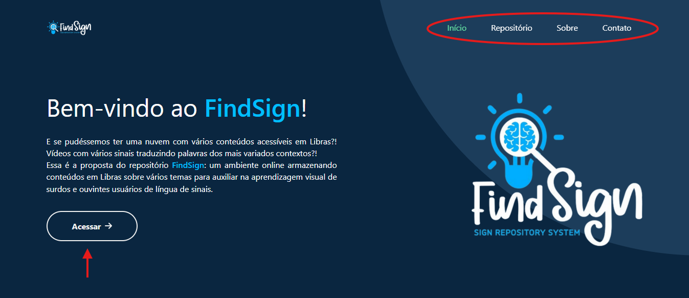

  

O FindSign é um repositório de sinais em Libras, inicialmente focado em termos relacionados à **tecnologia**, mas com a ideia de expandir futuramente para sinais de outros cursos e áreas de estudo.  
O site reúne vídeos e conteúdos educativos, funcionando como uma **ferramenta de referência** para estudantes e interessados em Libras aplicada ao universo acadêmico.

## Contexto acadêmico

Este projeto foi desenvolvido como parte da disciplina optativa de **Libras**, do curso de **História** do **UDF**.  
O professor responsável é **Saulo Xavier**, e a proposta era criar um recurso educativo que unisse **acessibilidade linguística** e **ferramentas digitais**, com foco na área de tecnologia, mas com possibilidade de crescimento para outras áreas.

## Tecnologias utilizadas

- HTML5
- CSS3 / Bootstrap
- JavaScript

## Acesse o projeto

O FindSign está disponível online através do **GitHub Pages**.  
Você pode visitar o site clicando no link abaixo:

[Ver FindSign online](https://seuusuario.github.io/findsign/)

## Como abrir localmente

Para visualizar o projeto no seu computador:

1. Clique em **“Code → Download ZIP”** no GitHub
2. Extraia a pasta em seu computador
3. Abra o arquivo `index.html` em qualquer navegador

## Como usar

A estrutura foi pensada para facilitar a navegação e tornar a experiência de aprendizado **interativa e visual**.

 -- Navegue entre as seções pelo menu ou pelo botão “Saiba mais”

 -- Explore os cards no repositório de sinais: clique para ver o vídeo e as informações sobre cada sinal

<video src="readme/repositorio.mp4" width="500" align="center"/>

## Como contribuir

O projeto foi desenvolvido para fins acadêmicos, mas contribuições e sugestões são bem-vindas.  
Caso queira colaborar:

1. Faça um fork deste repositório
2. Crie uma branch para sua modificação (`minha-ideia`)
3. Realize as alterações e commit
4. Envie um pull request descrevendo sua proposta

## Licença

Este projeto está licenciado sob a licença **MIT**.  
Você pode utilizá-lo, modificá-lo e distribuí-lo livremente, desde que mantenha os créditos.

---

## Colaboradores

Equipe de desenvolvimento:

  
  
  

